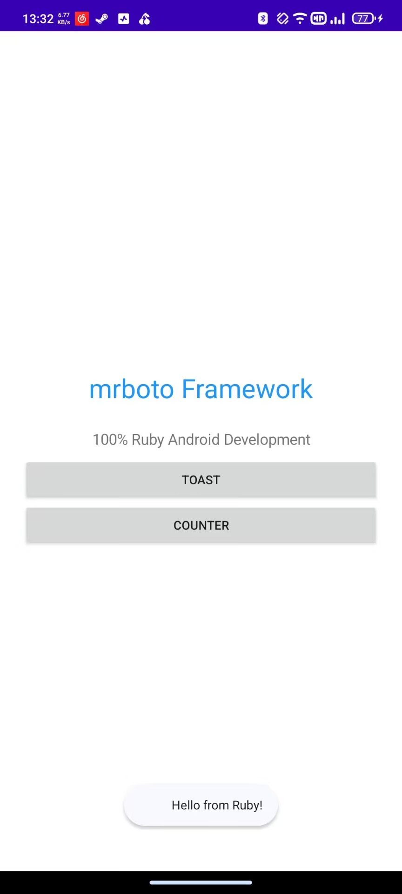
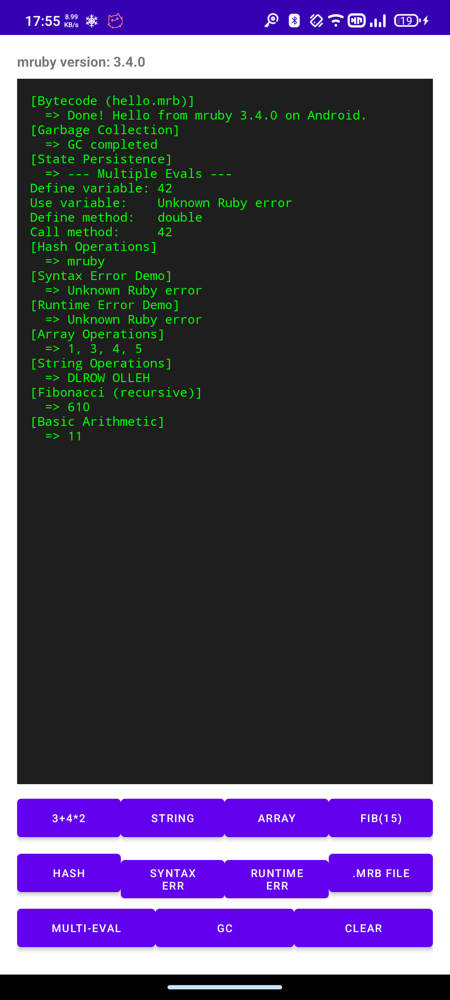

# mrboto

将 [mruby 3.4.0](https://mruby.org/) 嵌入 Android 应用的轻量级框架，支持 100% Ruby 开发。

[English Version](README.md)

## 截图

<span>
    
</span>

## 架构

三层架构：

| 层级 | 语言 | 职责 |
|---|---|---|
| C JNI 桥接 | C | 嵌入 mruby，通过 Java 反射将 Ruby 调用桥接到 Android API |
| Kotlin 封装 | Kotlin | 管理 mruby VM 生命周期、Java 对象注册表、事件监听器 |
| Ruby DSL | Ruby | 面向用户的 DSL：UI、生命周期、辅助函数 |

详见 [架构文档](https://github.com/Bemly/mrboto/wiki/Architecture-zh)。

## Maven 坐标

```
moe.bemly.mrboto:mrboto:26.4.11
```

## 快速开始

### 1. 添加依赖

```kotlin
// build.gradle.kts
dependencies {
    implementation("moe.bemly.mrboto:mrboto:26.4.11")
}
```

### 2. 配置 Application

```xml
<!-- AndroidManifest.xml -->
<application
    android:name="moe.bemly.mrboto.MrbotoApplication"
    ...>
```

### 3. 创建 Activity

```kotlin
class MainActivity : MrbotoActivityBase() {
    override fun getScriptPath() = "main_activity.rb"
}
```

### 4. 编写 Ruby UI

```ruby
# src/main/assets/main_activity.rb
class MainActivity < Mrboto::Activity
  def on_create(bundle)
    super
    self.title = "Hello mrboto"
    self.content_view = linear_layout(orientation: :vertical, padding: 16) {
      text_view(text: "你好", text_size: 20)
      button(text: "点击我") {
        toast("来自 mruby 的问候！")
      }
    }
  end
end
Mrboto._ruby_activity_class = MainActivity
```

## API 参考

| 文档 | 链接 |
|---|---|
| Kotlin API | [Wiki](https://github.com/Bemly/mrboto/wiki/Kotlin-API) |
| Ruby DSL | [Wiki](https://github.com/Bemly/mrboto/wiki/Ruby-DSL) / [中文版](https://github.com/Bemly/mrboto/wiki/Ruby-DSL-zh) |
| C Bridge | [Wiki](https://github.com/Bemly/mrboto/wiki/C-Bridge) / [中文版](https://github.com/Bemly/mrboto/wiki/C-Bridge-zh) |
| 架构 | [Wiki](https://github.com/Bemly/mrboto/wiki/Architecture) / [中文版](https://github.com/Bemly/mrboto/wiki/Architecture-zh) |

## Ruby DSL 可用方法

| 方法 | 说明 |
|---|---|
| `toast("消息")` | 显示 Toast |
| `linear_layout { }` | 创建 LinearLayout |
| `text_view(text: "...")` | 创建 TextView |
| `button(text: "...") { }` | 创建 Button，block 作为点击回调 |
| `edit_text { }` | 创建 EditText |
| `image_view { }` | 创建 ImageView |
| `scroll_view { }` | 创建 ScrollView |
| `shared_preferences("名称")` | 访问 SharedPreferences |
| `start_activity(class_name: "...")` | 启动新 Activity |
| `get_extra("key")` | 读取 Intent extra |
| `run_on_ui_thread { }` | 在 UI 线程执行块 |
| `dp(值)` | dp 转像素 |

完整 Widget 列表：`linear_layout`、`text_view`、`button`、`edit_text`、`image_view`、`scroll_view`、`relative_layout`、`check_box`、`switch_widget`、`progress_bar`、`spinner`、`radio_group`、`web_view`、`frame_layout`、`table_layout`

## 技术栈

| 组件 | 版本 |
|---|---|
| mruby | 3.4.0 |
| Android NDK | r29 (29.0.14206865) |
| minSdk | API 33 (Android 13) |
| targetSdk | API 36 |
| AGP | 9.1.0 |
| CMake | 4.1.2 |

## 开发

### 前置条件

- [Ruby](https://www.ruby-lang.org/) + `rake`
- [Android NDK r29](https://developer.android.com/ndk)
- [Android SDK](https://developer.android.com/studio) (API 33+)

### 构建 mruby 静态库

```bash
cd mruby && rake deep_clean && cd ..
./build-android.sh
```

此脚本会：
- 编译 host 工具（生成 `mrbc`）
- 交叉编译 arm64-v8a 和 x86_64 静态库
- 复制头文件和 `.a` 到 `app/src/main/cpp/mruby/`

### 发布到本地 Maven

```bash
./gradlew :mrboto:publishToMavenLocal
```

### 运行测试

```bash
./gradlew :mrboto:connectedAndroidTest
```

## 项目结构

```
├── app/                             # Android Library 模块 (:mrboto)
│   ├── build.gradle.kts
│   └── src/main/
│       ├── cpp/
│       │   ├── CMakeLists.txt
│       │   ├── native-lib.c         # mruby VM 生命周期
│       │   ├── android-jni-bridge.c # JNI 注册表、Java 反射桥接
│       │   └── mruby/               # mruby 头文件和静态库
│       ├── assets/mrboto/
│       │   ├── core.rb              # Mrboto 模块、JavaObject 基类
│       │   ├── layout.rb            # 布局常量、dp 转换
│       │   ├── activity.rb          # Activity 生命周期钩子
│       │   ├── widgets.rb           # Widget DSL (15 种 Widget)
│       │   └── helpers.rb           # toast、SharedPreferences 等
│       └── kotlin/moe/bemly/mrboto/
│           ├── MRuby.kt             # AutoCloseable 封装
│           ├── MrbotoApplication.kt # 启动时初始化全局 MRuby
│           ├── MrbotoActivityBase.kt# Activity 生命周期代理
│           ├── ViewListeners.kt     # 点击/文本/勾选监听器
│           └── JavaObjectWrapper.kt # 注册表参考文档
├── demo/                            # Demo 应用
├── build_config.rb                  # mruby 构建配置
├── build-android.sh                 # 一键构建脚本
└── mruby/                           # git 子模块 (tag 3.4.0)
```

## 工作原理

### Java 对象注册表

C 侧维护 4096 个槽位的 JNI GlobalRef 注册表。Java 对象存入后返回整数 ID，mruby 通过 ID 引用，避免 JNI 局部引用生命周期问题。

### 生命周期分发

```
Java onCreate → nativeDispatchLifecycle → mruby eval →
  Mrboto.current_activity.on_create(bundle)
```

### 事件回调

```
Ruby: button { toast("Hi") }
  → block 注册到回调表获得 ID
  → Activity.setViewClickListener(view_id, callback_id)
  → MrbotoClickListener 附加到 Android View
  → 用户点击 → onClick → mruby.eval("Mrboto.dispatch_callback($id, $viewId)")
  → 执行 block
```

### View 创建与方法调用

```
Ruby: linear_layout { } → Widgets.create_view() → C mrboto_create_view() →
  JNI FindClass + NewObject(Context) → 注册表 ID → View.from_registry(id)

Ruby: view.text = "Hello" → _call_java_method(registry_id, "setText", "Hello") →
  Java 反射: Class.getMethod("setText", CharSequence.class) + Method.invoke()
  → 整数参数使用 Integer.TYPE (int.class)
  → 浮点参数使用 Float.TYPE (float.class)
  → 布尔参数使用 Boolean.TYPE (boolean.class)
  → 字符串参数使用 CharSequence.class (setText 声明的参数类型)
  → JavaObject 参数使用 View.class
```

## 致谢

受 [Ruboto/JRuby9K_POC](https://github.com/ruboto/JRuby9K_POC) 启发 —— 该项目开创了在 Android 上运行 Ruby 的先河。mrboto 选择了不同的路线（嵌入 mruby 而非完整 JVM），但建立在前人工作的基础之上。

## 许可

MIT
